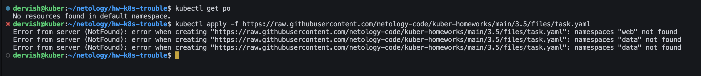
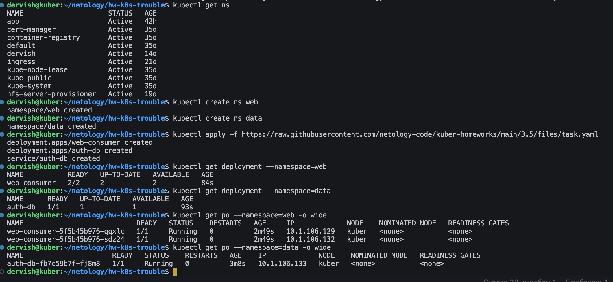
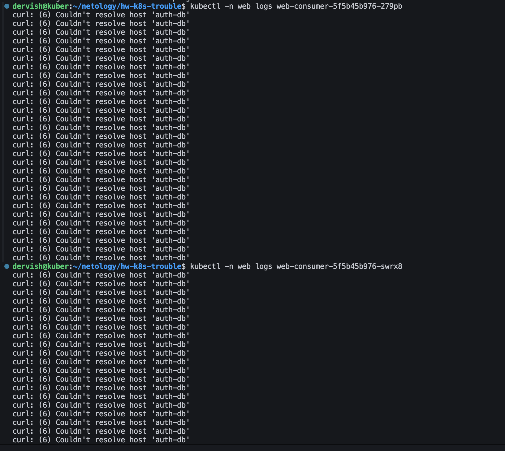
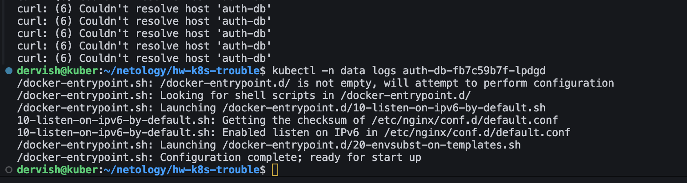
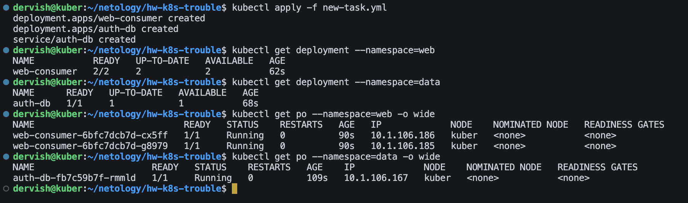
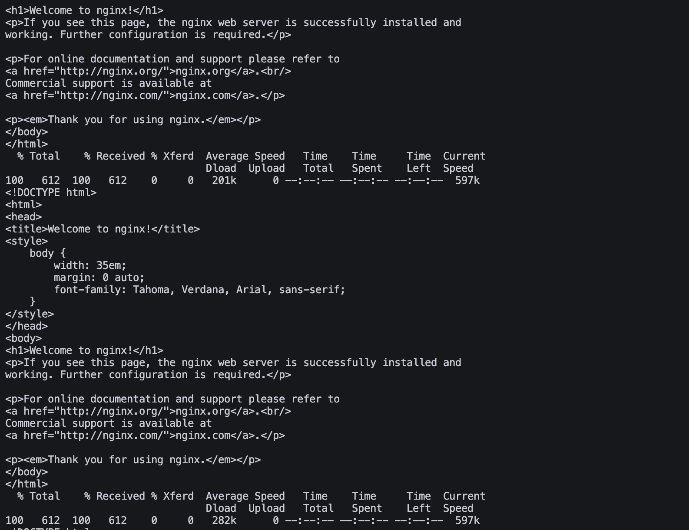
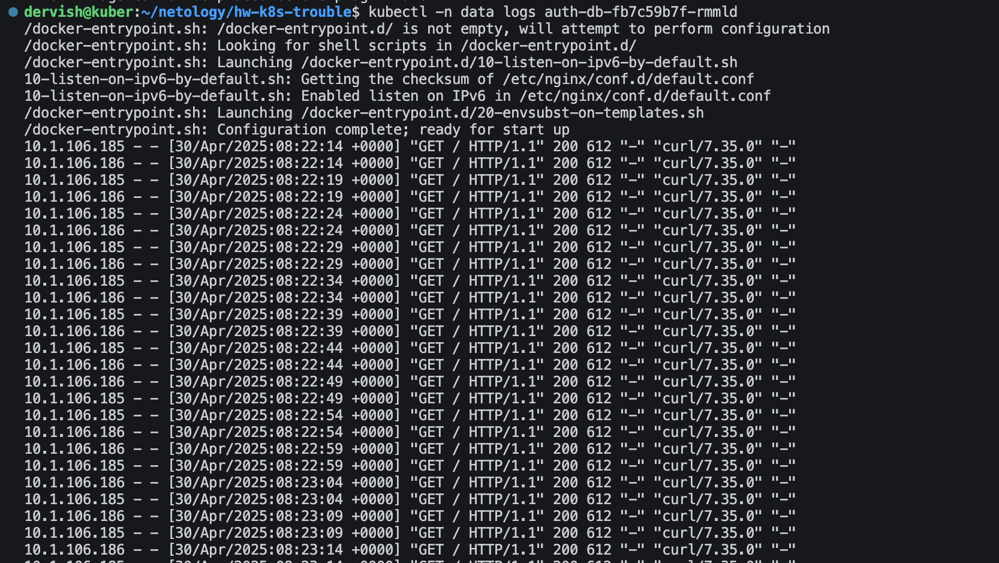

# Домашнее задание к занятию Troubleshooting

## Цель задания

Устранить неисправности при деплое приложения.

## Чеклист готовности к домашнему заданию

1. Кластер K8s.

## Задание. При деплое приложение web-consumer не может подключиться к auth-db. Необходимо это исправить

1. Установить приложение по команде:

>kubectl apply -f https://raw.githubusercontent.com/netology-code/kuber-homeworks/main/3.5/files/task.yaml

2. Выявить проблему и описать.

>На данном этапе развертывания видно, что ошибка заключается в отсутствии неймспейсов web и data. Создадим их и запустим установку заново.

3. Исправить проблему, описать, что сделано.

>На первый взгляд проблем больше нет. Посмотрим еще логи самих контейнеров.

>В приложении auth-db все в порядке. А вот в приложении web-consumer есть проблема, оно не может достучаться до auth-db по имени хоста. Проблема эта связана с тем, что приложения находятся в разных неймспейсах.

>Способов решения проблемы может быть несколько:

* зайти в каждый контейнер и прописать в /etc/hosts ip для auth-db - этот способ не совсем пригоден, поскольку при перезагрузке контейнера это действие придется снова выполнять

* переделать deployment и перенести все в один namespace - это сработает, но скорее всего разнесение по разным namespace сделано не просто так

* для доступа к сервисам другого namespace необходимо указать этот namespace в запросе, т.е. curl должен быть таким - curl auth-db.data - выберем этот вариант

>Создадим исправленный вариант развертывания [new-task.yml](new-task.yml)

4. Продемонстрировать, что проблема решена.

>После внесенных исправлений видно, что ошибки исчезли.
